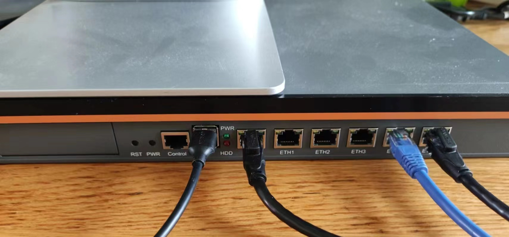
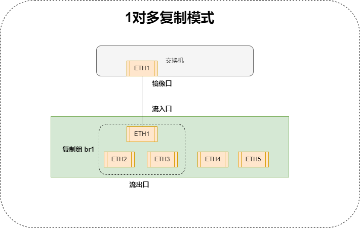
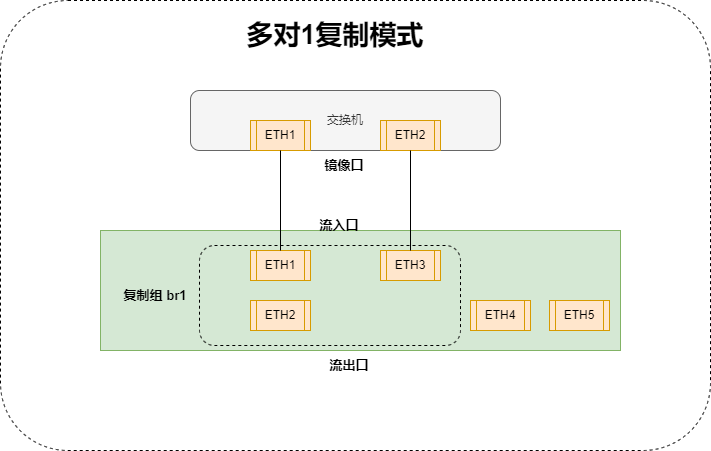
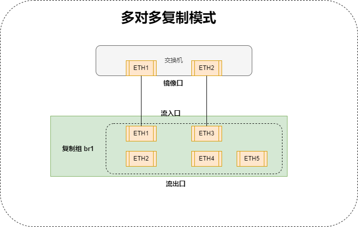
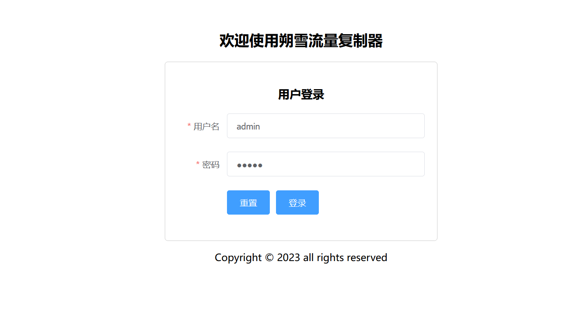
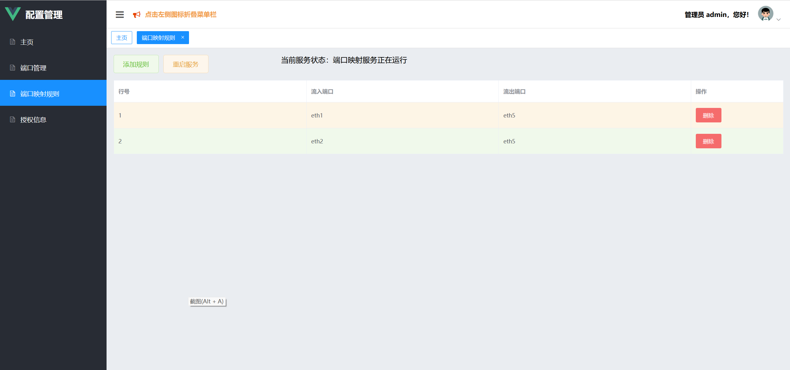
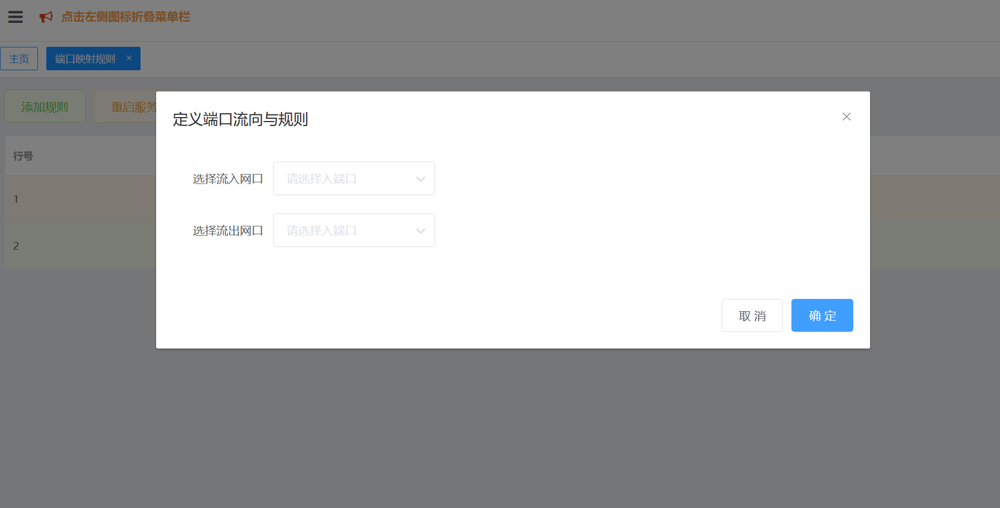

# linux port mirrors web frontend

# **朔雪流量复制器的前端**

## **1.** **功能简介**

本流量复制器使用端口映射模式实现流量复制，可以实现一对一，一对多，和多对一的流量复制模式。

 

映射网口的多少取决于设备的硬件，最多可以支持36端口。

使用模式包括**

1）从1个端口将流量复制到多个端口

 

 

 

2）从多个端口将流量汇聚到1个端口

 

 

3）从多个流入端口同时复制到多个流出端口，实现多对多复制

 

 

 

## **2.** **配置说明**

### **2.1** **设备登录**

**设备管理口为eth0，将管理使用的计算机网口设置为“192.168.1.x/24”****,****在浏览器中输入管理页面的地址“http://192.168.1.1”正常情况下可以看到登录页面如下：**

 

**用户名：admin**

**密码：admin**

 

### 2.2 端口映射规则

点击左侧导航栏，打开“端口映射规则”页面：

 

如果已经添加了规则，则可以看到当前规则列表；

示例中添加2条规则：

- Eth1  复制到 Eth5

- Eth2  复制到 Eth5

 

【删除】点击右侧“删除”按钮删除当前行；

【添加】点击顶部“添加规则”按钮，在弹出页面中添加规则；

 

注意：这里的流入端口与流出端口不能相同，而且所有使用的流入端口不能作为流出端口使用，同理使用过的流出的端口不能流入；也就是说，流入与流出属性互斥；

 

备注：规则序号不影响使用效率，仅仅为了编辑方便而使用；

### 2.3 启用规则

规则添加完成后，点击“重启服务”按钮，即可应用现有的规则执行流量复制。

##  3. 联系方式

本项目为整个系统的前端部分，如果有需要整套软件的同学请联系：

**QQ/WX：390017268**

 

 

 